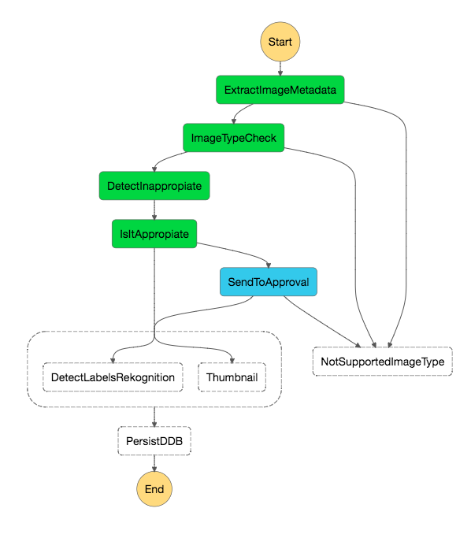
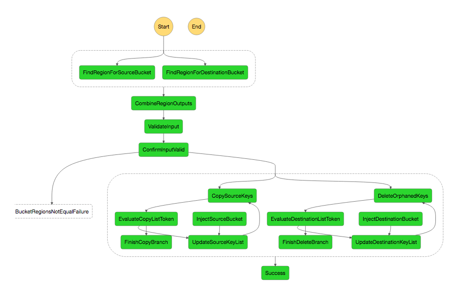
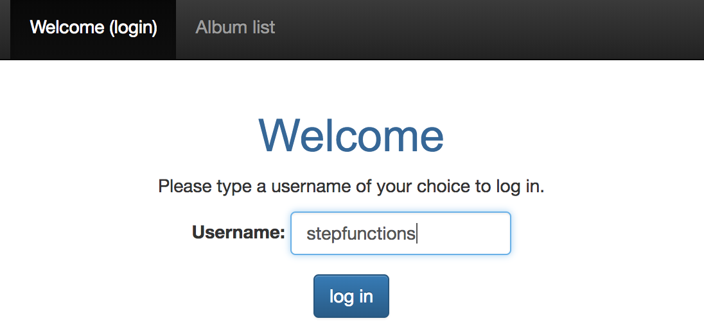
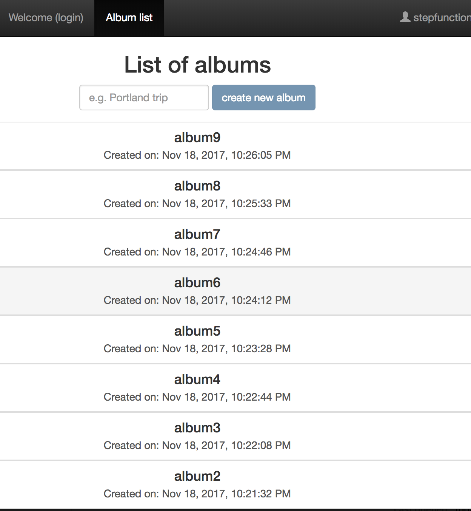
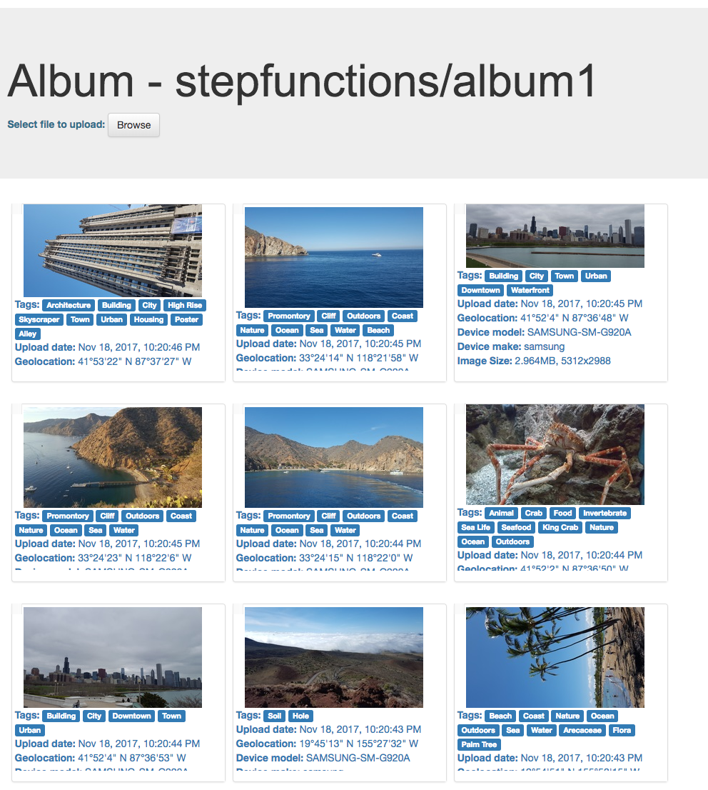
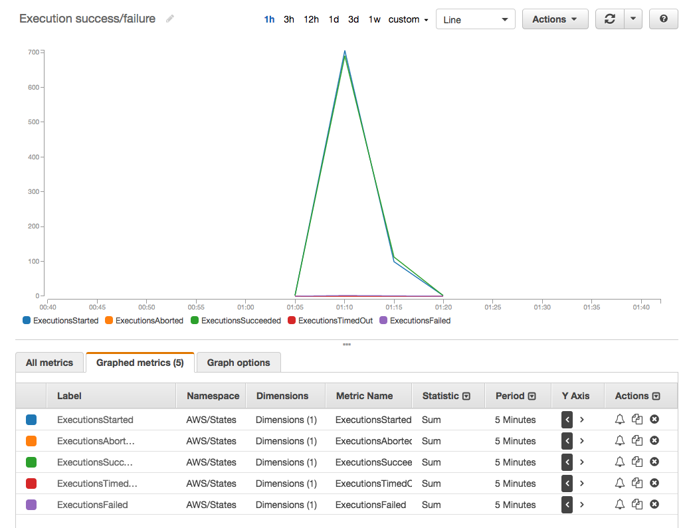
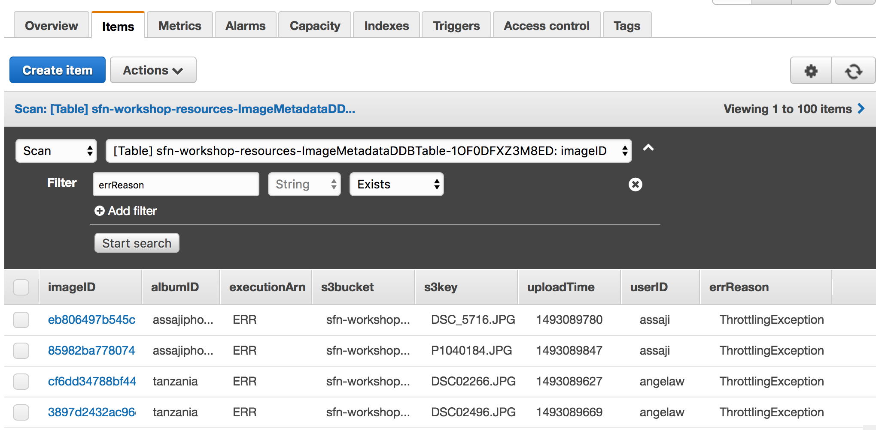

# 추가 단계

이제 StepFunctions 및 웹 응용 프로그램과 상호 작용할 응용 프로그램을 만들었으므로 몇 가지 추가 크레딧을 얻으세요!

여기 도전은 당신의 전투를 선택하세요 :)

### A 단계 : 코드가 아닌 상태 머신 내에서 재시도를 구현합니다.

일부 오류는 엔드 포인트의 스로틀, 람다의 시간 초과, 예기치 않은 예외 및 실행 오류로 인해 재시도가 필요할 수 있습니다. 베르너 보겔 스 (Werner Vogels)는 아마존의 CTO는 "모든 것이 항상 실패합니다."라고 말했습니다.

여기서의 도전 과제는 [재시도](http://docs.aws.amazon.com/step-functions/latest/dg/amazon-states-language-errors.html)에 대한 설명서를 사용하여 필요할 때마다 각 작업의 재시도를 구현하세요. 좋은 규칙은 다시 시도하면 안되는 오류 집합을 지정한 다음 다른 모든 오류를 catch하도록 다시 시도 정책을 설정하는 것입니다.

> 예 : 이미지 유형이 지원되지 않으면 다시 시도 할 필요가 없습니다. 그러나 PersistDDB가 *"ProvisionedThroughputExceededException"* 으로 실패할 경우 데이터 저장을 다시 시도해야합니다. 이 설정에서 다른 백 오프 및 최대 시도로 재생할 수 있습니다.
>
> 다양한 오류를 시뮬레이트하여 재시도 정책을 테스트 할 수 있습니다. 예를 들어 추출 이미지 메타 데이터 람다 함수는 큰 이미지에 대해 실행될 때까지 몇 초가 걸릴 수 있습니다. 람다 콘솔로 가서 추출 이미지 메타 데이터 기능 타임 아웃을 1 초로 변경하고 2MB보다 큰 이미지를 상태 머신으로 전달하고 재시도가 시작되는지 확인할 수 있습니다.


### B 단계 : 부적절한 것으로 의심되는 콘텐츠에 대한 수동 승인

고객은 플랫폼 내에서 사진을 업로드합니다. 이 콘텐츠 중 일부는 신청서에 부적절한 것으로 간주 될 수 있습니다.

**Amazon Rekognition**에서는 API 호출 [DetectModerationLabels](http://docs.aws.amazon.com/rekognition/latest/dg/API_DetectModerationLabels.html)을 사용하여이 내용을 쉽게 플래그 할 수 있습니다.

여기서의 도전 과제는 StepFunctions에서 수동 승인 활동으로 구현하는 것입니다. 당신은 *ExtractMetadata* 작업 내에서 그것을 할 수 있습니다 또는 이러한 이미지를 검토하기 위해 후속 작업을 구현할 수 있습니다.


> - 이 [블로그](https://aws.amazon.com/blogs/compute/implementing-serverless-manual-approval-steps-in-aws-step-functions-and-amazon-api-gateway/)를 참조하세요. 단계 함수에서 수동 승인 단계를 구현하는 예제
>
> - 승인은 중재 라벨에서 0-100의 신뢰도 값을 제공하기 때문에**선택 상태**를 사용하여 부적절한 콘텐츠에 대한 확신이 높은 사진을 자동으로 거부하고 약한 용의자에 대해 수동 승인을 사용할 수 있습니다.
>
> - 부적절한 내용을 식별하려면 새로운 람다 함수를 만들어야합니다. 또한 [Python](https://boto3.readthedocs.io/en/latest/reference/services/rekognition.html#Rekognition.Client.detect_moderation_labels) 또는 [node.js](http://docs.aws.amazon.com/AWSJavaScriptSDK/latest/AWS/Rekognition.html#detectModerationLabels-property)에 대한 몇 가지 SDK 예제를 찾을 수 있습니다.) 원하는 것을 선택하고이 작업을 구현하세요!
>
> - 결과를 *ResultPath*에 추가하는 것을 잊지 마세요. 이전 단계를 검토하여 *선택 사항*, *작업* 및 [여기](https://aws.amazon.com/blogs/compute/implementing-serverless-manual-approval-steps-in-aws) 구현 방법에 대한 자세한 정보를 찾으세요. (http://docs.aws.amazon.com/step-functions/latest/dg/concepts-activities.html)을 구현하기 위해 (예 : -step-functions-and-amazon-api-gateway /)
>
> - 귀하의 StateMachine을 테스트하세요 ... 조심스럽게!
>

상태 머신이 "어떻게 될지"의 모습을 빠르게 볼 수 있습니다.



보시다시피 상태 SendToApproval은 활동이 승인되기를 기다리고 있습니다. API 호출을 통해 이러한 작업을 승인하거나 거부 할 수 있습니다. [http://docs.aws.amazon.com/step-functions/latest/apireference/API_SendTaskSuccess.html] 및 [here](http : // docs.aws.amazon.com/step-functions/latest/apireference/API_SendTaskFailure.html).

예를 들어 다음은 활동을 승인하거나 거부하는 두 가지 간단한 스크립트입니다.

***Approve***
```
aws stepfunctions send-task-success --task-token $(aws stepfunctions get-activity-task --activity-arn arn:aws:states:us-west-2:012344556789:activity:sendToApproval | jq .taskToken) --task-output "{}"
```
***Deny***
```
aws stepfunctions send-task-failure --task-token $(aws stepfunctions get-activity-task --activity-arn arn:aws:states:us-west-2:031877956887:activity:sendToApproval | jq .taskToken) --error "InappropiateError"
```
<details>
<summary><strong> JSON 정의를 확장합니다.</strong></summary><p>

```JSON
{
  "StartAt": "ExtractImageMetadata",
  "Comment": "New State Machine - Created with StepEasy",
  "States": {
    "ExtractImageMetadata": {
      "Type": "Task",
      "Resource": "arn:aws:lambda:us-west-2:012345678901:function:sfn-workshop-setup-ExtractMetadata",
      "Catch": [
        {
          "ErrorEquals": [
            "ImageIdentifyError"
          ],
          "ResultPath": "",
          "Next": "NotSupportedImageType"
        }
      ],
      "ResultPath": "$.extractedMetadata",
      "Next": "ImageTypeCheck"
    },
    "NotSupportedImageType": {
      "Type": "Fail",
      "Cause": "Image type not supported!",
      "Error": "FileNotSupported"
    },
    "ImageTypeCheck": {
      "Type": "Choice",
      "Choices": [
        {
          "Or": [
            {
              "Variable": "$.extractedMetadata.format",
              "StringEquals": "JPEG"
            },
            {
              "Variable": "$.extractedMetadata.format",
              "StringEquals": "PNG"
            }
          ],
          "Next": "DetectInappropiate"
        }
      ],
      "Default": "NotSupportedImageType"
    },
    "DetectInappropiate":{
        "Type": "Task",
        "Resource": "arn:aws:lambda:us-west-2:012345678901:function:detectInappropiate",
        "ResultPath": "$.inappropiate",
        "Next": "IsItAppropiate"
      },
      "IsItAppropiate":{
        "Type": "Choice",
        "Choices": [
          {
              "Not": {
                "Variable": "$.inappropiate",
                "BooleanEquals": true
              },
              "Next": "Parallel"
          }
        ],
        "Default": "SendToApproval"
      },
      "SendToApproval":{
        "Type": "Task",
        "Resource": "arn:aws:states:us-west-2:012345678901:activity:sendToApproval",
        "Catch": [
          {
            "ErrorEquals":[ "States.ALL" ],
            "Next": "NotSupportedImageType"
          }
        ],
        "ResultPath": "$.approval",
        "Next": "Parallel"
      },
    "Parallel": {
      "Type": "Parallel",
      "Branches": [
        {
          "StartAt": "DetectLabelsRekognition",
          "Comment": " - Created with StepEasy",
          "States": {
            "DetectLabelsRekognition": {
              "Type": "Task",
              "Resource": "arn:aws:lambda:us-west-2:012345678901:function:sfn-workshop-setup-DetectLabel",
              "End": true
            }
          }
        },
        {
          "StartAt": "Thumbnail",
          "Comment": " - Created with StepEasy",
          "States": {
            "Thumbnail": {
              "Type": "Task",
              "Resource": "arn:aws:lambda:us-west-2:012345678901:function:sfn-workshop-setup-Thumbnail",
              "End": true
            }
          }
        }
      ],
      "ResultPath": "$.parallelResults",
      "Next": "PersistDDB"
    },
    "PersistDDB": {
      "Type": "Task",
      "Resource": "arn:aws:lambda:us-west-2:012345678901:function:sfn-workshop-setup-PersistDDB",
      "End": true
    }
  }
}
```

</details>

### C 단계 : 이미지를 S3로 대량 복사하여 동시성을 테스트합니다.

몇가지 샘플 이미지로 작업 흐름을 끝까지 테스트 했으므로 수천 개의 이미지가있는 S3 버킷의 이미지를 사진 랜딩 버킷에 복사하여이 설정에 부하를 추가 할 수 있습니다.

상태 머신을 설정하려면 여기의 지침을 따르세요.

[https://github.com/awslabs/sync-buckets-state-machine](https://github.com/awslabs/sync-buckets-state-machine)

동일한 상태에서 2 개의 버킷 내용을 동기화하기 위해 다른 상태 머신을 사용합니다.



소스 버킷의 경우 사용중인 AWS 지역에 따라 다음을 사용하세요.


Region | S3 Bucket to copy from
------|-------
EU (Ireland) | <span style="font-family:'Courier';"> sfn-image-workshop-bulk-photo-copy-eu-west-1 </span>
US East (N. Virginia) | <span style="font-family:'Courier';"> sfn-image-workshop-bulk-photo-copy-us-east-1 </span>
US West (Oregon) | <span style="font-family:'Courier';">sfn-image-workshop-bulk-photo-copy-us-west-2 </span>

Input to the state machine to sync contents would look like this:

```
{
  "source": "sfn-image-workshop-bulk-photo-copy-eu-west-1",
  "destination": "<REPLACE_WITH_YOUR_PhotoLandingS3Bucket>",
  "prefix": "Incoming/"

}
```


가져온 이미지를 탐색하려면 웹 응용 프로그램에서`stepfunction` 사용자를 사용하세요.



앨범 목록이 표시되어야합니다.



생성 된 태그, 메타 데이터 및 미리보기 이미지 탐색 :



#### 모니터링 및 측정 항목

CloudWatch Metrics 콘솔로 이동하여 State Machine 이름을 검색하여 실행 메트릭을 탐색하세요. 성공 / 실패 측정 항목에 대해 '합계'통계를 사용합니다.



버킷에 복사 된 모든 이미지가 Step Functions에 의해 처리 되었습니까? 다음 두 가지 방법으로 확인할 수 있습니다.

1. 람다 트리거 (Lambda trigger) 기능 ([람다 콘솔](https://us-west-2.console.aws.amazon.com/lambda/home?region=us-west-2))의 메트릭으로 이동하세요. ```StartExecution```을 포함하는 함수 이름을 검색하세요. 해당 기능을 클릭하고**모니터링**탭으로 이동하세요.**호출 오류**가 보이십니까? 오류가 무엇인지 확인하려면 람다 로그를 확인하세요.
1. DynamoDB 테이블 (```sfn-workshop-resources-ImageMetadataDDBTable-``으로 시작하는 테이블 이름을 찾습니다)에서**errReason**필드 (또는**executionArn**field equals**ERR**) :


