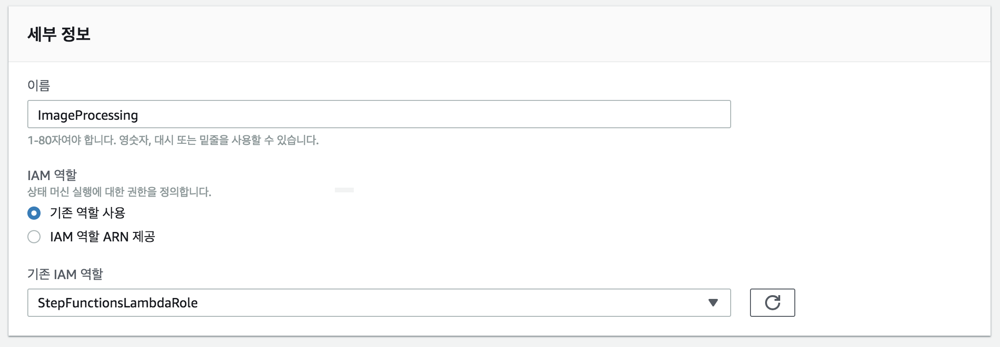
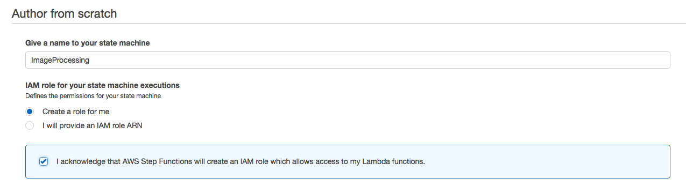
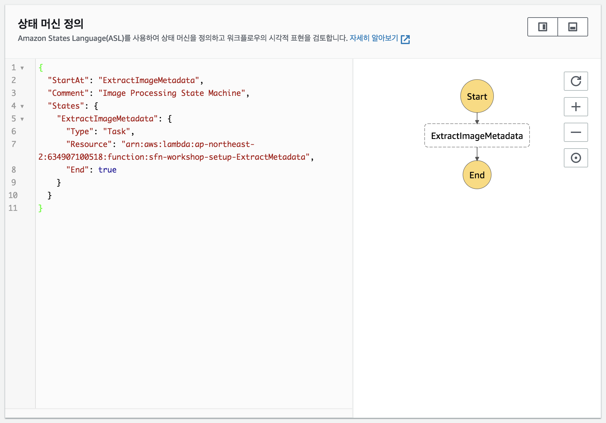
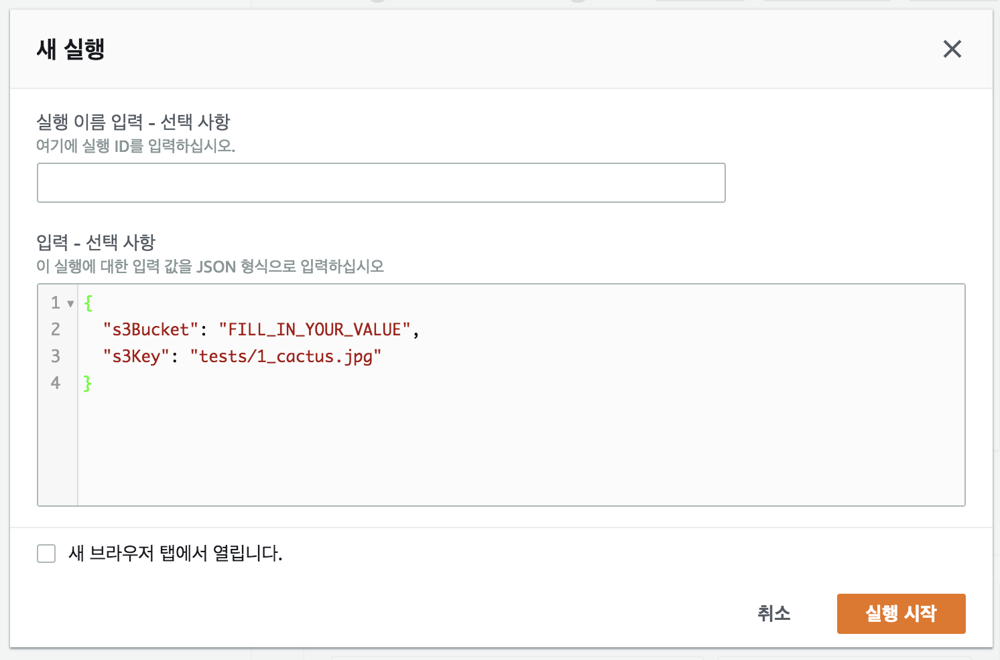
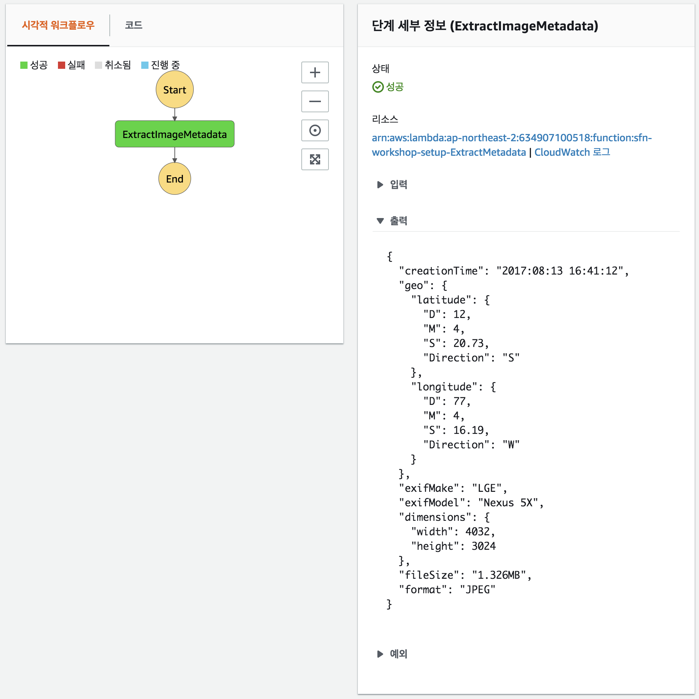
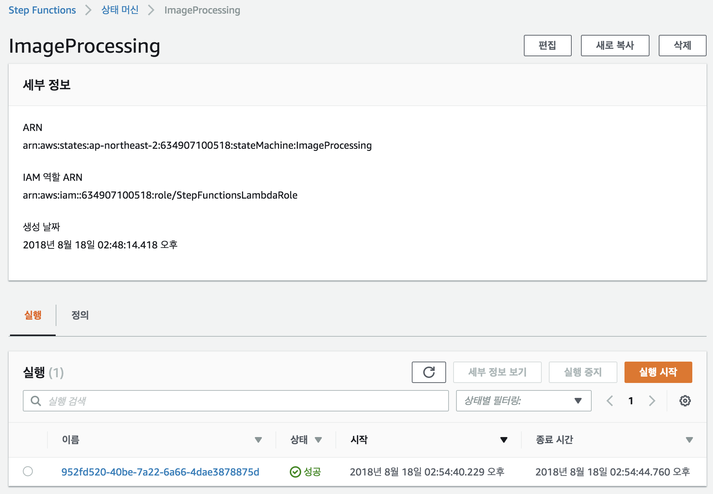
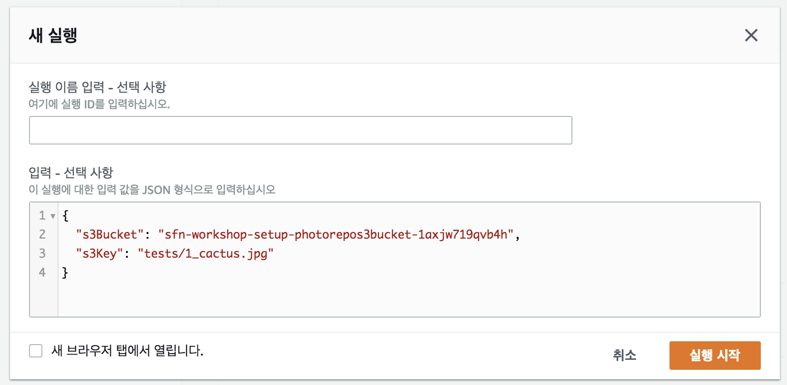
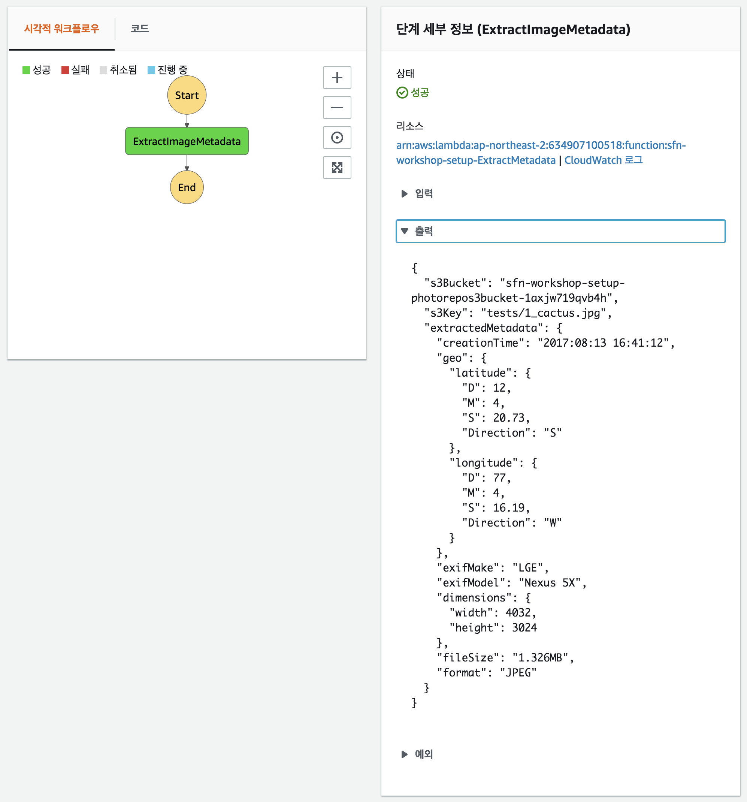

## 1 단계 : AWS 스텝 함수에 첫 번째 람다 스텝 추가하기 상태 머신

AWS Step Functions 상태 시스템을 작성하여 처리 단계를 조정하려면 단일 단계가 포함 된 시스템부터 시작합니다.

단계 함수 상태 시스템은 [Amazon States Language](https://states-language.net/spec.html)를 사용하여 JSON에 정의됩니다. 단일 단계로 상태 시스템을 정의하는 아래의 JSON을 살펴보세요.

```javascript
{
  "StartAt": "ExtractImageMetadata",
  "Comment": "Imgage Processing State Machine",
  "States": {
    "ExtractImageMetadata": {
      "Type": "Task",
      "Resource": "arn:aws:lambda:us-west-2:012345678912:function:sfn-workshop-setup-ExtractMetadata",
      "End": true
    }
  }
}
```	

이 상태 시스템이 시작되면 AWS Step Functions 인터프리터는 시작 상태를 식별하여 실행을 시작합니다. 이 상태를 실행 한 다음 상태가 끝 상태로 표시되는지 확인합니다. 그럴 경우 기계는 종료되고 결과를 리턴합니다. 상태가 End State가 아니면 해석기는 다음에 실행할 상태를 결정하기 위해 "다음"필드를 찾습니다. 터미널 상태 (성공, 실패 또는 종료 상태)에 도달하거나 런타임 오류가 발생할 때까지이 프로세스를 반복합니다.

JSON을 직접 저작하여 상태 시스템 정의를 구성하는 경우 [statelint](https://github.com/awslabs/statelint) 도구를 사용하여 상태 시스템을 만들기 전에 JSON의 유효성을 검사해야합니다.

### 1A 단계 : AWS 람다 작업 상태 추가

1. 원하는 텍스트 편집기에서 JSON으로 상태 시스템 정의를 시작하세요.

	```javascript
	{
	  "StartAt": "ExtractImageMetadata",
	  "Comment": "Image Processing State Machine",
	  "States": {
	    "ExtractImageMetadata": {
	      "Type": "Task",
	      "Resource": "REPLACE_WITH_YOUR_LAMBDA_ARN",
	      "End": true
	    }
	  }
	}
	```	

1. JSON에서 'REPLACE_WITH_YOUR_LAMBDA_ARN` 문자열을 메타 데이터 추출 AWS 람다 함수의 ARN으로 대체합니다.
	> 메타 데이터 추출 AWS 람다 함수의 ARN을 찾으려면 AWS CloudFormation Console에서**sfn-workshop-setup**스택으로 이동하고 출력 섹션에서**ExtractMetadataLambda**를 찾습니다.
	>
	> 'arn:aws:lambda:ap-northeast-2:<YOUR-ACCOUNT-ID>:function:sfn-workshop-setup-ExtractMetadata`와 같은 형식이어야합니다.


### 1B 단계 : 초기 AWS 단계 함수 작성 상태 시스템

1. [AWS Step Functions 관리 콘솔](http://console.aws.amazon.com/states/home)로 이동하세요.

1. 이전에 AWS 단계 함수를 사용하지 않았다면 시작 페이지를 볼 수 있습니다. 이 경우**시작하기**를 클릭하면 새 상태 시스템을 만드는 페이지로 연결됩니다. 그렇지 않으면**상태 시스템 만들기**버튼을 클릭하세요.

1. 상태 머신 이름으로 `ImageProcessing`을 입력하세요.

1. 상태 시스템 실행을 위한 **IAM 역할**에 대해 이미 단계 기능에 대해 생성 된 IAM 역할이있는 경우**기존 역할 사용**을 선택하고 계정에 이미 존재하는 IAM 역할을 선택하세요

	

	단계 기능을 위해 생성 된 IAM 역할이없는 경우**나를위한 역할 만들기**를 선택하고 IAM 역할이 만들어 질 것임을 확인하는 확인 표시를 클릭하세요.

	


1. 섹션이 나타날 때까지 아래로 스크롤하세요. **Step3 : 코드 및 시각 워크 플로우를 검토하세요.**
	1A 단계에서 내 보낸 JSON에 붙여 넣기

1. &#x21ba; **Visual Workflow**옆의 아이콘을 클릭하여 상태 시스템의 시각적 표현을 새로 고칩니다.

	

1. **상태 시스템 작성**을 클릭하여 상태 시스템을 작성하세요.


### 1C 단계 : 상태 머신 실행 테스트

1.**새 실행**버튼을 클릭하여 새 실행을 시작합니다.

1. AWS Step Functions 상태 머신으로 전달 된 입력 데이터를 처리하도록 지정합니다.

   단계 함수 상태 머신의 각 실행에는 고유 한 ID가 있습니다. 실행을 시작할 때 하나를 지정하거나 서비스가 생성하도록 할 수 있습니다. "실행 ID를 여기에 입력하세요."라는 텍스트 필드에서 실행 ID를 지정하거나 비워 둘 수 있습니다.

	입력 데이터의 경우 다음 JSON 템플릿을 사용하세요. 자신의 값으로 s3Bucket 필드를 대체하세요.

	```JSON
	{
	  "s3Bucket": "FILL_IN_YOUR_VALUE",
	  "s3Key": "tests/1_cactus.jpg"
	}
	```

	> 's3Bucket'및 's3Key` 필드는 Amazon S3 버킷 및 그림이 저장되는 키의 이미지 처리 작업 흐름을 알려줍니다.

	`s3Bucket` 필드의 경우, 'PhotoRepoS3Bucket'을위한**sfn-workshop-setup**스택의**Output**섹션을보세요.

	테스트 입력 JSON을 텍스트 편집기 (Sublime, Notepad++ 등)에 저장하는 것이 좋습니다. 이후 단계에서 다시 사용하기 때문입니다.

	**실행 시작**을 클릭하세요.


	

1. 이제 상태 머신 실행 상태를 볼 수 있습니다. 콘솔에서 여러 탭을 탐색하여이 실행을 위해 사용할 수있는 정보를 확인하세요.

	


### 1D 단계 : ResultPath를 사용하여 원본 입력과 출력을 결합합니다.

방금 만든 상태 머신의**출력**을 살펴보면 람다 함수에 의해 이미지에서 추출 된 메타 데이터에 대한 유용한 정보가 많이 있지만, 이 단계로 전달 된 원래 입력 데이터? 예를 들어 후속 단계에서는 이미지가 저장된 s3Bucket 및 s3Key에 대한 참조가 필요합니다.

한 가지 옵션은 람다 함수 자체에이 논리를 작성하여 입력 데이터를 람다 함수의 출력으로 복사하는 것입니다. 또는 단계 기능은 우리가 활용할 수있는 기능을 제공합니다 -**경로**. 이 기능을 사용하면 작업에 전달 된 입력을 조작하고 JSON 경로 표현식을 사용하여 다음 상태로 전달되는 작업의 출력을 조작 할 수 있습니다.

**경로**필드에는 세 가지 유형이 있습니다. **InputPath**, **ResultPath**, **OutputPath**. ([documentation](https://docs.aws.amazon.com/step-functions/latest/dg/awl-ref-paths.html) 및 [Amazon States Language specification.](https : //states-language.net/spec.html#path))

구체적인 필요에 따라 **ResultPath**필드를 사용합니다. 이 필드는 데이터를 다음 상태로 전달하기 위해 정의되며, 입력 JSON의 어느 부분이 실행 결과로 대체 될지 (예 : 람다 함수의 출력) 기본적으로 (생략 된 경우),이 필드는`$ '을 취합니다. 즉, 실행 결과는 전체 데이터가 다음에 전달되는 것을 의미합니다 (OutputPath는 ResultPath의 출력을 추가로 필터링 할 수 있음). 이 동작은 명시 적으로 JSON 경로를 지정하여 변경할 수 있습니다.

- **ResultPath**JSON 경로 표현식이 상태 입력의 항목과 일치하면 해당 입력 항목 만 상태 작업 실행 결과로 겹쳐 쓰입니다. 수정 된 전체 입력이 주 출력에 사용 가능하게됩니다.

- **ResultPath**JSON 경로 표현식이 상태 입력의 항목과 일치하지 않으면 해당 항목이 입력에 추가됩니다. 이 항목에는 상태 작업을 실행 한 결과가 포함됩니다. 확장된 입력이 상태 출력에 사용 가능하게됩니다.

이제 `$ .extractedMetadata`를 상태 머신에 추가 한 단계의 결과 경로로 추가하세요.

<details>
<summary><strong> 단계별 지침 펼치기 </strong> </summary><p>

1. AWS Step Functions 관리 콘솔 페이지에서**대시 보드**를 클릭하여 상태 시스템 목록으로 돌아갑니다.

1. 방금 만든 상태 머신을 선택하세요.**상태 시스템 편집**을 클릭하세요.

	

1. 속성 "ResultPath": "$ .extractedMetadata"를 태스크에 추가하세요. 마지막 JSON은 다음과 같아야합니다.

	```javascript
	{
	  "StartAt": "ExtractImageMetadata",
	  "Comment": "Image Processing State Machine",
	  "States": {
	    "ExtractImageMetadata": {
	      "Type": "Task",
	      "Resource": "arn:aws:lambda:us-west-2:012345678912:function:sfn-workshop-setup-ExtractMetadata",
	      "ResultPath": "$.extractedMetadata",
	      "End": true
	    }
	  }
	}
	```
	
1. 또한 나중에 추가 작업을 위해 텍스트 편집기에 새 정의를 복사 / 붙여 넣기하세요.

1. **업데이트를 클릭하고 실행을 시작하세요.**

1. 1C-2 단계에서 사용한 것과 동일한 JSON 입력을 입력하세요 ( 'ImageProcessing`의 실행 기록으로 이동하여 세부 정보> 입력 평면에서 JSON을 복사하여 찾을 수 있습니다).**실행 시작**을 클릭하세요.

	

</details>

변경 후 새로운 실행을 위해 **Output**에 상태 입력 속성과 작업 출력을 포함하는 추가 필드`extractedMetadata`가 포함되어 입력과 출력을 효과적으로 병합합니다



이제 [Step 2](step-2.md)로 이동할 준비가되었습니다!
