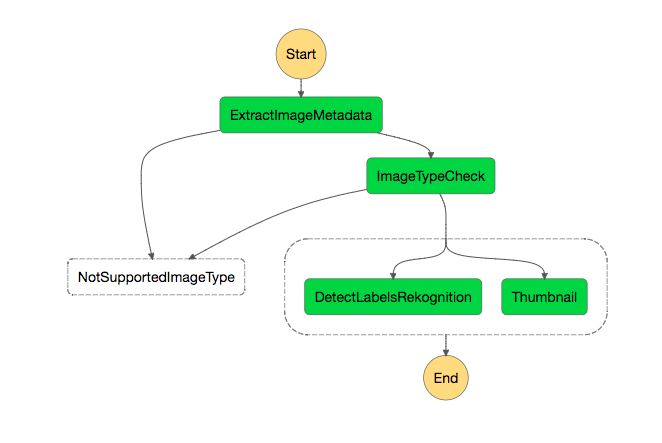
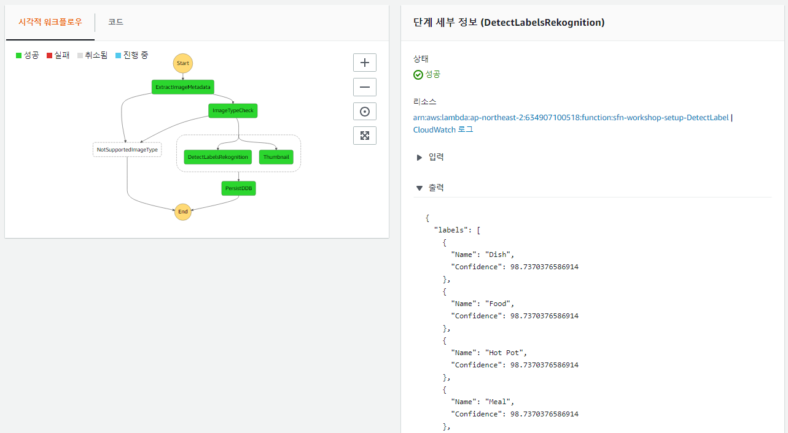

## 3 단계 : 워크 플로우에 병렬 처리 추가

메타 데이터를 추출하고 확인한 후 이제 상태 시스템에 몇 가지 단계를 추가할 준비가되었습니다. 엄지 손톱 찍기, 이미지 인식 및 메타 데이터 색인 유지 / 영구화입니다. 엄지 손톱과 이미지 인식은 서로 의존하지 않고 병렬로 발생할 수 있으며 [평행 상태](https://docs.aws.amazon.com/step-functions/latest/dg/amazon-states-language-parallel-state.html)을 참조하세요.



### 3A 단계 : 상태 머신 정의 업데이트

이제 상태 시스템에 단계를 점진적으로 추가, 배치 및 테스트하고, 현재 상태 시스템에 병렬 단계를 추가하는 몇 가지 경험을 얻었습니다 (마지막 상태의 최종 JSON에서 내보내거나 가져 오는 것을 잊지 마세요). )을 사용하여 엄지 손톱과 이미지 인식을 동시에 수행 할 수 있습니다.

구문에 대한 도움이 필요하면 다음 설명서를 살펴보세요.

- [병렬 상태](https://docs.aws.amazon.com/step-functions/latest/dg/amazon-states-language-parallel-state.html)
- [작업 상태](https://docs.aws.amazon.com/step-functions/latest/dg/amazon-states-language-task-state.html)
- [Amazon States Language Spec](https://states-language.net/spec.html)

위에서 언급 한 문서에 대한 링크를 쉽게 따라갈 수 있도록 JSON을 직접 편집하는 것이 좋습니다.

<details>
<summary><strong> 힌트를 얻기 위해 확장 </strong></summary><p>

- 첫 번째 단계는 *Parallel* 상태의 유형을**Pass**에서**Parallel**로 변경하는 것입니다.

- **병렬**상태 내의 병렬 작업은 객체의 배열로 지정되며 각각의 객체는 자체 포함 된 상태 머신 객체입니다.

	```JSON
	"Parallel": {
	  "Type": "Parallel",
	  "Branches": [<STATE_MACHINE_OBJECT>, ..., <STATE_MACHINE_OBJECT>],
	  "End": true
	}
	```

- 각 분기에 대해 해당 람다 함수를 트리거하는 **Task**상태가 있는 상태 머신 개체를 만듭니다.
	심층 학습 기반 이미지 분석 [Amazon Rekognition](https://aws.amazon.com/rekognition/) 서비스와 특히 [DetectLabels API]를 활용하는``sfn-workshop-setup-DetectLabel`` ](http://docs.aws.amazon.com/rekognition/latest/dg/API_DetectLabels.html)에서 처리 된 이미지에 표시 할 개체와 개념에 대한 메타 데이터를 얻을 수 있습니다.

	- 축소판 생성을 위해 [GraphicsMagick for node.js](http://aheckmann.github.io/gm/docs.html) 라이브러리에 의존하는 ``sfn-workshop-setup-Thumbnail``

</details>

이제 단계 1D를 기억할 수있는 좋은 시간이었습니다. 상태 입력을 병합하여 출력과 병합하는 방법을 배웠으므로 [AWS 단계 함수 경로](https://docs.aws.amazon.com/step-functions/latest/dg/awl-ref-paths.html)

특히 *Parallel* 상태에서 **ResultPath**를 사용하여 병렬 상태 시스템 출력의 배열을 다운 스트림 상태에서 사용할 수있게하세요. `parallelResults` 속성을 사용하세요.

<details>
<summary><strong> 힌트를 얻기 위해 확장 </strong></summary><p>

```JSON
"Parallel": {
  "Type": "Parallel",
  "Branches": [<STATE_MACHINE_OBJECT>, ..., <STATE_MACHINE_OBJECT>],
  "ResultPath": "$.parallelResults",
  "End": true
}
```
</details>


이제 원하는 이미지로 상태 머신을 테스트하세요!

- Amazon Rekognition에서 감지 한 레이블과 축소판의 S3 위치가 모두 출력에서 ​​사용 가능한지 확인하세요.

	

- 축소판이 **Thumbnail** 폴더 아래의 S3 버킷에 있는지 확인하세요.


### 마지막 JSON
<details>
<summary><strong> JSON 정의를 확장합니다. </strong></summary><p>

```JSON
{
  "StartAt": "ExtractImageMetadata",
  "Comment": "Image Processing State Machine - step 3 final",
  "States": {
    "ExtractImageMetadata": {
      "Type": "Task",
      "Resource": "arn:aws:lambda:us-west-2:012345678901:function:sfn-workshop-setup-ExtractMetadata",
      "Catch": [
        {
          "ErrorEquals": [
            "ImageIdentifyError"
          ],
          "ResultPath": "$.error",
          "Next": "NotSupportedImageType"
        }
      ],
      "ResultPath": "$.extractedMetadata",
      "Next": "ImageTypeCheck"
    },
    "ImageTypeCheck": {
      "Type": "Choice",
      "Choices": [
        {
          "Or": [
            {
              "Variable": "$.extractedMetadata.format",
              "StringEquals": "JPEG"
            },
            {
              "Variable": "$.extractedMetadata.format",
              "StringEquals": "PNG"
            }
          ],
          "Next": "Parallel"
        }
      ],
      "Default": "NotSupportedImageType"
    },
    "NotSupportedImageType": {
      "Type": "Fail",
      "Cause": "Image type not supported!",
      "Error": "FileTypeNotSupported"
    },
    "Parallel": {
      "Type": "Parallel",
      "Branches": [
        {
          "StartAt": "DetectLabelsRekognition",
          "States": {
            "DetectLabelsRekognition": {
              "Type": "Task",
              "Resource": "arn:aws:lambda:us-west-2:012345678901:function:sfn-workshop-setup-DetectLabel",
              "End": true
            }
          }
        },
        {
          "StartAt": "Thumbnail",
          "States": {
            "Thumbnail": {
              "Type": "Task",
              "Resource": "arn:aws:lambda:us-west-2:012345678901:function:sfn-workshop-setup-Thumbnail",
              "End": true
            }
          }
        }
      ],
      "ResultPath": "$.parallelResults",
      "End": true
    }
  }
}

```
</details>

### 다음 단계
이제 [Step 4](step-4.md)로 이동할 준비가 되었습니다!

